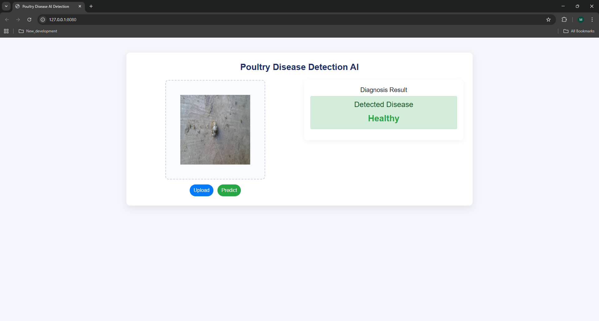
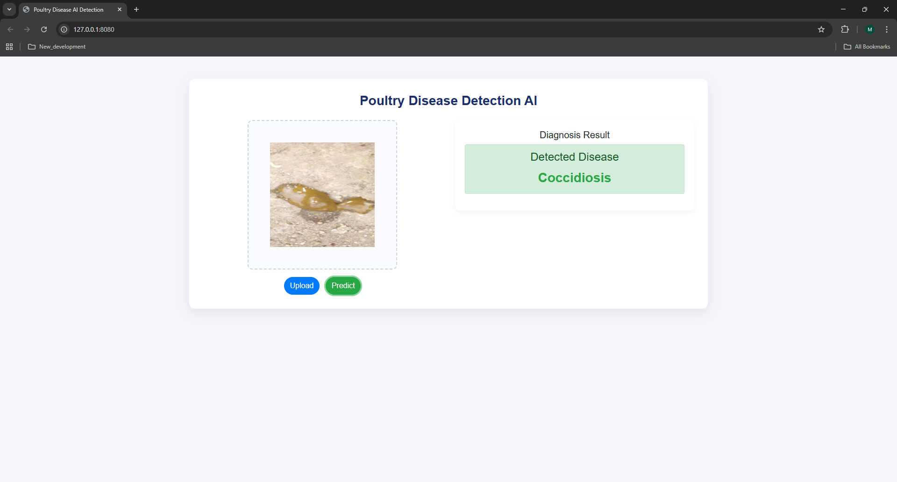
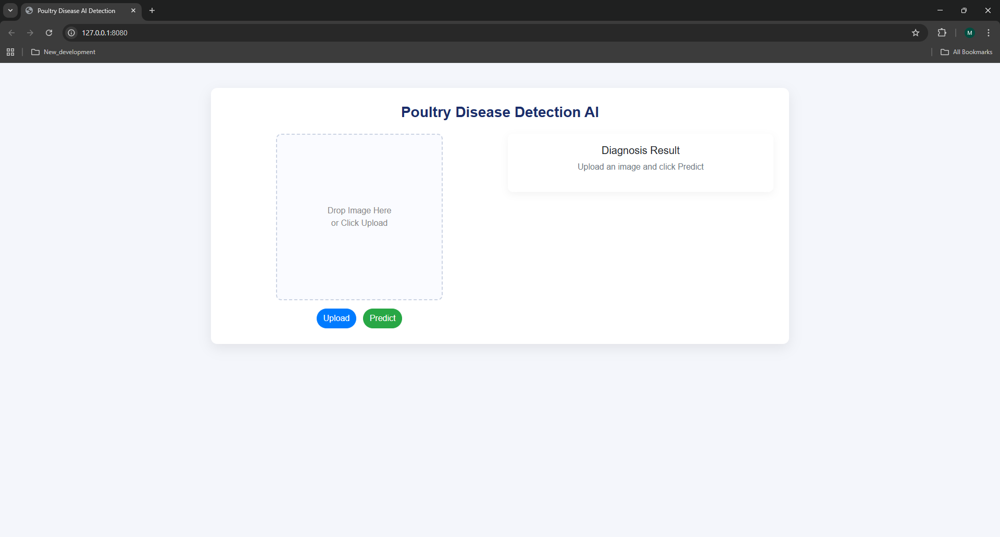
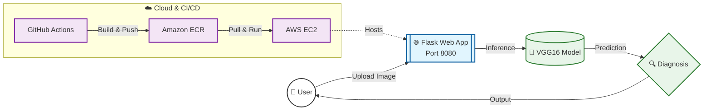
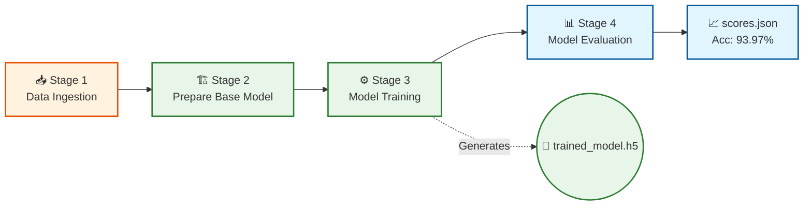
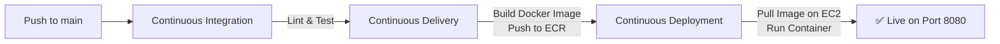

<div align="center">

# 🐔 Poultry Disease Detection System

### End-to-End Deep Learning Pipeline for Chicken Disease Classification

[](https://python.org)
[](https://tensorflow.org)
[](https://huggingface.co)
[](https://flask.palletsprojects.com)
[](https://dvc.org)
[](https://docker.com)
[](https://github.com/features/actions)
[](https://aws.amazon.com/ec2)
[](https://aws.amazon.com/ecr)
[](https://numpy.org)
[](https://pandas.pydata.org)
[](https://matplotlib.org)
[](https://jquery.com)
[](https://getbootstrap.com)
[](#-model-performance)

<br>

This project implements a **complete, production-grade deep learning pipeline** for detecting **Coccidiosis** — a common and potentially fatal parasitic disease in poultry — by analyzing **chicken fecal images**. The system uses **transfer learning** with a **VGG16** convolutional neural network pretrained on ImageNet, where the base layers are frozen and a custom dense classification head is added and fine-tuned on a curated dataset of healthy vs. infected fecal samples.

The ML workflow is structured as a **4-stage reproducible pipeline** orchestrated by **DVC** (Data Version Control) — covering data ingestion, base model preparation, training with data augmentation and TensorBoard/checkpointing callbacks, and final evaluation. A **Flask web application** which lets users upload images and receive instant predictions. The entire application is **containerized with Docker**, pushed to **Amazon ECR**, and deployed to an **AWS EC2** instance via a **GitHub Actions CI/CD pipeline** using a self-hosted runner.

<br>

| Healthy Prediction | Coccidiosis Detection |
|:---:|:---:|
|  |  |

<br>

</div>

---

## 📝 My Approach

For <i><b>each stage</b></i> of the poultry disease classification pipeline, I follow a modular and reproducible development workflow:

1. **Update `config.yaml`** — Define data sources, model paths, and artifact roots.
2. **Update `secrets.yaml` [Optional]** — Configure sensitive credentials or cloud access details.
3. **Update `params.yaml`** — Adjust training hyperparameters (Image size, Batch size, Epochs, etc.).
4. **Update the Entity** — Define data structures and return types in `src/CNNClassifier/entity/`.
5. **Update the Configuration Manager** — Update the `ConfigurationManager` in `src/CNNClassifier/config/`.
6. **Update the Components** — Implement the core ML logic (Ingestion, Preparation, Training, Evaluation).
7. **Update the Pipeline** — Orchestrate the components in `src/CNNClassifier/pipeline/`.
8. **Update `main.py`** — Register and run the pipeline stages.
9. **Update `dvc.yaml`** — Define dependencies and outputs for automated pipeline tracking.

---

## 📋 Table of Contents

- [My Approach](#-my-approach)
- [Demo](#-demo)
- [Model Performance](#-model-performance)
- [Architecture](#-architecture)
- [Project Structure](#-project-structure)
- [Getting Started](#-getting-started)
- [ML Pipeline](#-ml-pipeline-dvc)
- [Docker Deployment](#-docker-deployment)
- [AWS Cloud Deployment](#-aws-cloud-deployment-ec2--ecr)
- [CI/CD Pipeline](#-cicd-pipeline)
- [Development Workflow](#-development-workflow)
- [Tech Stack](#-tech-stack)

---

## 🎬 Demo

The web application provides a clean drag-and-drop interface for real-time disease diagnosis:

<div align="center">



</div>

**How it works:**
1. **Upload** — Drag & drop or click to upload a chicken fecal image
2. **Predict** — Click the Predict button to run inference
3. **Result** — The diagnosis (Healthy / Coccidiosis) is displayed instantly

---

## 📊 Model Performance

<div align="center">

| Metric | Score |
|:---:|:---:|
| **Accuracy** | **93.97%** |
| **Loss** | **0.1745** |

</div>

> **Model:** VGG16 pretrained on ImageNet, fine-tuned with custom classification head for binary classification (Healthy vs Coccidiosis).

---

## 🏗️ Architecture

The system is split into **User Inference (Real-time)** and **ML Training (Reproducible)** pipelines, automated via CI/CD.

### 🌐 User Inference & 🚀 Deployment Flow



### 🧠 ML Lifecycle (DVC Pipeline)



---

## 📁 Project Structure

```
DeepLearning_ETE_Pr1/
│
├── 📂 .github/workflows/
│   └── main.yaml                        # CI/CD: GitHub Actions → ECR → EC2
│
├── 📂 src/CNNClassifier/
│   ├── components/                      # Core ML modules
│   │   ├── data_ingestion.py            #   ↳ Download & extract dataset
│   │   ├── prep_base_model_trainer.py   #   ↳ VGG16 + custom head
│   │   ├── prep_callbacks.py            #   ↳ TensorBoard & checkpointing
│   │   ├── model_training.py            #   ↳ Training loop with augmentation
│   │   └── model_eval.py               #   ↳ Evaluation & metrics
│   ├── pipeline/                        # Stage-wise orchestration
│   │   ├── stage_1_data_ingestion.py
│   │   ├── stage_2_prep_base_model_trainer.py
│   │   ├── stage_3_model_training.py
│   │   ├── stage_4_model_eval.py
│   │   └── predict.py                  # Inference pipeline
│   ├── config/                          # Configuration manager
│   ├── entity/                          # Dataclass definitions
│   ├── constants/                       # Path constants
│   └── utils/                           # Helpers (image decoding, etc.)
│
├── 📂 config/
│   └── config.yaml                      # Paths, URLs, model paths
│
├── 📂 research/                         # Jupyter notebooks (experimentation)
│   ├── 01_data_ingestion.ipynb
│   ├── 02_prepare_base_model.ipynb
│   ├── 03_prepare_callbacks.ipynb
│   ├── 04_model_trainer.ipynb
│   └── 05_model_eval.ipynb
│
├── 📂 templates/                        # Flask HTML templates
├── 📂 artifacts/                        # DVC-tracked model artifacts
├── 📂 logs/                             # Runtime logs
│
├── app.py                               # 🚀 Flask application entry point
├── main.py                              # 🔄 Full training pipeline runner
├── Dockerfile                           # 🐳 Container definition
├── dvc.yaml                             # 📊 DVC pipeline stages
├── params.yaml                          # ⚙️ Hyperparameters
├── scores.json                          # 📈 Evaluation metrics
├── setup.py                             # 📦 Package configuration
├── requirements.txt                     # 📋 Python dependencies
└── template.py                          # 🏗 Project scaffolding script
```

---

## 🚀 Getting Started

### Prerequisites

- Python 3.10+
- Git

### Installation

```bash
# Clone the repository
git clone https://github.com/AhsanN51/DeepLearning_ETE_Pr1.git
cd DeepLearning_ETE_Pr1

# Create & activate virtual environment
python -m venv venv
venv\Scripts\activate          # Windows
# source venv/bin/activate     # macOS/Linux

# Install dependencies
pip install -r requirements.txt
```

### Train the Model

```bash
# Option 1: Run the full pipeline
python main.py

# Option 2: Use DVC (recommended — caches intermediate results)
dvc repro
```

### Launch the Web App

```bash
python app.py
```

Open **http://localhost:8080** → upload a chicken fecal image → click **Predict**.

---

## ⚙ ML Pipeline (DVC)

The training workflow is split into **4 reproducible stages** managed by [DVC](https://dvc.org):

| Stage | Pipeline | What It Does |
|:---:|---|---|
| **1** | Data Ingestion | Downloads & extracts chicken fecal image dataset from GitHub |
| **2** | Prepare Base Model | Loads VGG16 (ImageNet weights), freezes base layers, adds custom dense head |
| **3** | Model Training | Fine-tunes with augmentation, TensorBoard logging & model checkpointing |
| **4** | Model Evaluation | Runs evaluation on test set → outputs `scores.json` |

### Hyperparameters

```yaml
# params.yaml
IMAGE_SIZE: [224, 224, 3]    # VGG16 input dimensions
BATCH_SIZE: 16
EPOCHS: 20
LEARNING_RATE: 0.001
WEIGHTS: imagenet
CLASSES: 2                   # Healthy vs Coccidiosis
INCLUDE_TOP: False
AUGMENTATION: True
```

### DVC Commands

```bash
dvc repro             # Run full pipeline (skips cached stages)
dvc dag               # Visualize pipeline DAG
dvc metrics show      # Show evaluation metrics
dvc plots diff        # Compare metrics across experiments
```

---

## 🐳 Docker Deployment

```bash
# Build
docker build -t chicken-disease-classifier .

# Run
docker run -d -p 8080:8080 --name chickendisease chicken-disease-classifier
```

The app runs on `http://localhost:8080`.

> **Base image:** `python:3.10-slim-bullseye` with AWS CLI pre-installed for S3/ECR access.

---

## ☁ AWS Cloud Deployment (EC2 + ECR)

This project is deployed to **AWS EC2** using **Amazon Elastic Container Registry (ECR)** for Docker image management.

### ECR Repository

```
360025768117.dkr.ecr.ap-south-1.amazonaws.com/chickendisease
```

### AWS Setup Steps

1. **IAM User** — Create with policies:
   - `AmazonEC2ContainerRegistryFullAccess`
   - `AmazonEC2FullAccess`

2. **ECR Repository** — Create a private repository (e.g., `chickendisease`)

3. **EC2 Instance** — Launch Ubuntu instance:
   ```bash
   # Install Docker on EC2
   sudo apt-get update
   sudo apt-get install -y docker.io
   sudo usermod -aG docker $USER
   ```

4. **Self-Hosted Runner** — Configure the EC2 instance as a GitHub Actions runner:
   - Go to **Repo → Settings → Actions → Runners → New self-hosted runner**
   - Follow the setup instructions on the EC2 instance

5. **GitHub Secrets** — Add the following to your repo:

   | Secret | Description |
   |---|---|
   | `AWS_ACCESS_KEY_ID` | IAM access key ID |
   | `AWS_SECRET_ACCESS_KEY` | IAM secret access key |
   | `AWS_REGION` | e.g., `ap-south-1` |
   | `AWS_ECR_LOGIN_URI` | e.g., `360025768117.dkr.ecr.ap-south-1.amazonaws.com` |
   | `ECR_REPOSITORY_NAME` | e.g., `chickendisease` |

---

## 🔁 CI/CD Pipeline

Fully automated via **GitHub Actions** (`.github/workflows/main.yaml`):



| Job | Runner | What It Does |
|---|---|---|
| **Continuous Integration** | `ubuntu-latest` | Code checkout, linting, unit tests |
| **Continuous Delivery** | `ubuntu-latest` | Build Docker image → push to Amazon ECR |
| **Continuous Deployment** | `self-hosted` (EC2) | Pull latest image → run container on port 8080 |

> **Trigger:** Every push to `main` (ignores `README.md` changes).


## 🛠 Tech Stack

| Category | Technology |
|---|---|
| **Deep Learning** | TensorFlow / Keras, VGG16 (Transfer Learning) |
| **Web Framework** | Flask, Flask-CORS |
| **ML Pipeline** | DVC (Data Version Control) |
| **Experiment Tracking** | TensorBoard, DVC Metrics |
| **Containerization** | Docker |
| **Cloud Infrastructure** | AWS EC2, Amazon ECR |
| **CI/CD** | GitHub Actions (self-hosted runner) |
| **Data Processing** | NumPy, Pandas, SciPy |
| **Visualization** | Matplotlib, Seaborn |
| **Configuration** | PyYAML, python-box |

---

<div align="center">

### 👤 Author

**Muhammad Ahsan**

[](mailto:muhammadahsan8013@gmail.com)
[](https://github.com/AhsanN51)

---

⭐ **Star this repo if you found it useful!**

</div>